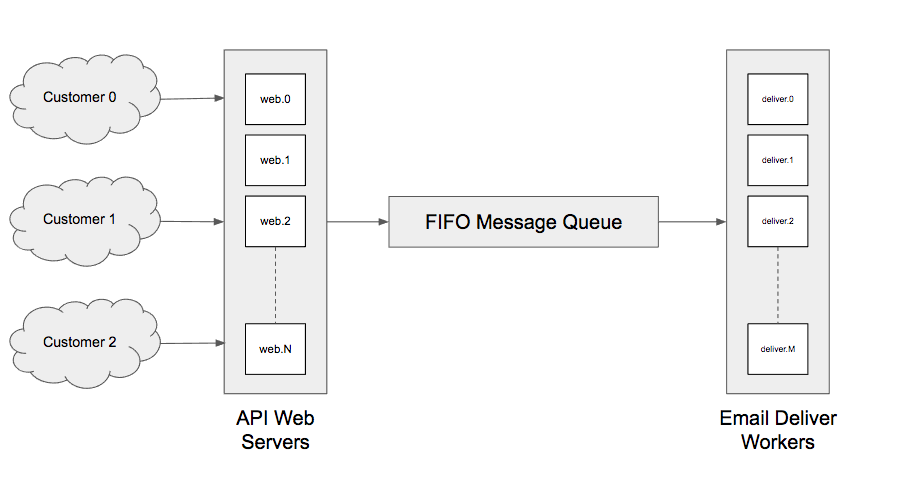
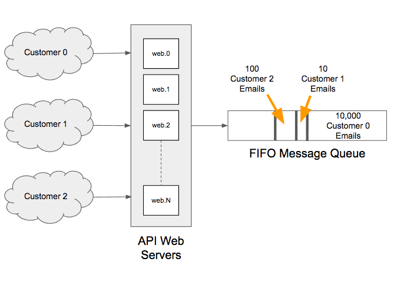

High-Throughput Queuing Architecture
====================================

You will be analyzing and improving a high-throughput email queuing system (how relevant!).

#### Overview

A long, long time ago, Sendwithus had an email pipeline that failed to scale in a few different ways. We'd like you to
assess the limitations of that system and discuss possible solutions in detail with our engineering team.

Feel free to leverage any tools, technologies, and/or frameworks you're comfortable with;
in fact we encourage you to use anything that will help you work faster.

After the allotted time, you will demonstrate the following:

* Where you think limitations existed in the initial system
* Possible solutions to the suggested questions
* What it would take to implement those solutions
* Any side effects of implementation
* Your thought process while working on the project

This is an intentionally ambitious project for the time given. __We do not expect you to complete it__.

We do expect you to accomplish as much as you can, and to treat this like a real-world engineering scenario.

What We're Looking For
----------------------

We're primarily interested in how you think about technology, system architecture, how you approach
large problems, and your ability to dive fearlessly into new challenges.

You will be assessed on the following:

* Ability to analyze, reason about, and design complex software systems
* Knowledge of high-throughput web development and the surrounding best practices
* Ability to constructively discuss a problem space and possible solutions

You May...
----------
* Use the internet freely
* Ask us any questions you'd like (just interrupt one of us)

You May Not...
--------------
* Enlist the help of others outside of the Sendwithus team. Remember, questions are okay!
* Work outside of the Sendwithus office

Inital Design
-------------

Sendwithus offers an API to send templated, transactional email. Every API request results in a single email being sent.
Our customers integrate our API into their app, and rely on this service to send real-time emails to their customers.
Email types include welcome emails, invitations, notifications, invoices, password resets, etc. As a result,
our system needs to operate as real-time as possible - we pride ourselves on minimizing lag between API request
and the corresponding email send, and our customers rely on this level of sustained performance.

Assume the current system works like this:
* HTTP API request is received by Web Servers
* Web Servers validate the request and place it onto a simple FIFO queue
* Email Deliver Workers receive from the queue one message at a time
* Each worker renders and delivers the email before moving onto the next

#### Questions
* How would you measure performance of this system?
* How would you demonstrate to customers that the system is working optimally?

Problem 1: Message Prioritization
------------------------------

Some customers send at much higher rates than others. For example, a large customer might perform 10,000 requests/min, while a small
customer may only make a single request every 10 minutes.

Further, customers have very different sending patterns. One customer might maintain constant throughput throughout the day, while
another might burst 1,000,000 requests over a short period and then go silent. In both situations, we need to offer the best possible delivery performance.

This means it's often the case that a single customer can dramatically effect system performance by filling the queue with their requests.
The following situation can occur easily.

In this example, all of Customer 0's emails must be delivered before Customer 1 and Customer 2's emails can be delivered.

#### Questions
* How would you re-architect the system to handle and/or prevent this scenario?
* How does your solution guarantee that lower-throughput customers receive real-time service?

Problem 2: Deliver Worker Autoscaling
-----------------------------------

Global system traffic can be quite bursty, and it is often the case that running M deliver workers running is either too many or not enough to
handle the current workload.

Constantly keeping the maximum number of workers active is very cost inefficient, and running too few worker risks a large burst of requests
causing significant delays in email delivery.

#### Questions
* How would you optimize worker count in real-time?
* What effect would your solution have on system cost and delivery performance?

Problem 3: API Throttling
-----------------------

The initial system described above makes no attempt to throttle the number of requests being accepted from any one customer.
Any one customer can freely flood the system with their own requests (valid or not), and force poor performance on other customers.

At the same time, some customers require (and pay for) the ability to send large bursts of traffic - allowing their traffic specifically
is a requirement.

#### Questions
* How would you build customer-based request rate limiting into this system?
* What effect would your solution have on system performance?
* How would you detect and prevent abusive traffic?

Problem 4: Guaranteed Once Delivery
---------------------------------

All queueing systems promise a) at-most-once delivery, or b) at-least-once delivery. Both heuristics cause
problems for this system. Failing to deliver an email is unacceptable, as is delivering an email twice (or more).

#### Questions
* How would you guarantee at most-once delivery?
* What effect would your solution have on system performance?
